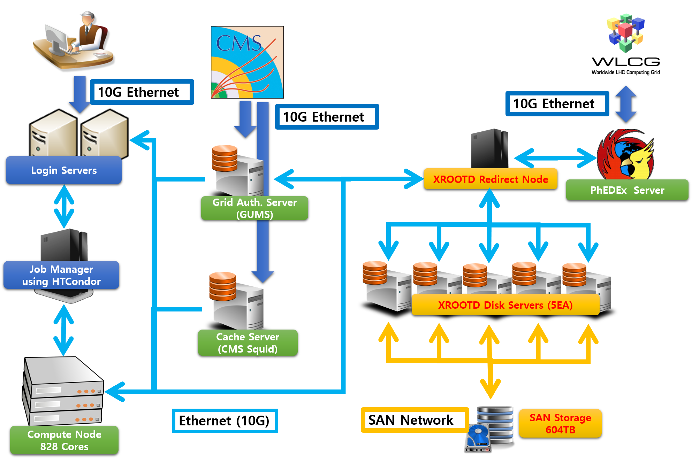

# CMS Tier-3 Computing Environment

## Introduce about Computing Resource



### Computing Elements

CMS Tier-3 consists of an integrated environment with ALICE Tier-3 (KiAF). There are a total of 23+ servers allocated to CMS Tier-3 (24 servers including GPU servers), and a total of 20,000 CPU logical cores. (1000 physical cores, half of them) It has a total of 4,280 job slots, combined with 800 of KIAF. CPU cores deploy or retrieve resources using the HTCondor Job Manager. Therefore, in order to submit the job, you need to know how to use the HTCondor. In addition, if there is no job by other group users, more than 2000 slots can be used. However, when KIAF users submit their job, they automatically return 800 cores, which are for KIAF, and the job that used to run in the returned job slot is canceled and queued. Please refer to the next page, HTCondor, for detailed instructions on how to use it.

### GPU Elements

KISTI-GSDC CMS Tier-3 is equipped with one GPU server to provide machine learning and GPGPU functions. If you want to use this, we recommend you to use it by accessing the GPU UI server. Please use the command below to connect to the server.

```bash
## Can not access from remote. Please, login from ui server.
ssh [CMS GPU Server]
```

### Important Directories

#### 1. /cms (User Home)

The /cms space is provided for scratches for storing users' home directories and temporary data. The total storage space is 20TB, which is mounted as NFS. To use too many data affects another user's home directory, so please predict the size of the results in advance and use them carefully to prevent problems.


The /cms directory is only available to everyone for 2.5TB. If you need additional capacity, you should configure to use /cms\_scratch described below or send it directly to storage. Please note that the administrator may request deletion at any time for additional space used.


#### 2. /cms\_scratch (Scratch)

It is a scratch space for temporary use.


The space is accessible from the UI and WN, but all files are deleted 7 days after file creation.


#### 3./xrootd (Long-term storage)

CMS Tier-3 provides exclusive 1004TB resources to KCMS researchers. Of these, 604TB is SAN storage, and 400TB is provided through NAS storage. There are a total of five servers provided as storage, each connected with a 10Gbps NIC. Therefore, the theoretical maximum bandwidth is 50Gbps. Each storage server is integrated through the XRootD program. Therefore, the performance is best when copying or deleting files through the xrdfs command. Since it also provides GSIFTP and SRM protocols using Rucio and gfal-utils can also be used. However, when using xrootd and gsiftp, the URL is different, so be careful.

| Protocol  |                    GSIFTP                    |              XROOT for Public             |             XROOT for Internal             |
| --------- | :------------------------------------------: | :---------------------------------------: | :----------------------------------------: |
| Prefix    |                   gsiftp://                  |                  root://                  |                   root://                  |
| Server    |               cms-se.sdfarm.kr               |             cms-xrdr.sdfarm.kr            |             cms-xrdr.private.lo            |
| Directory |                //xrootd/store                |                //xrd/store                |                 //xrd/store                |
| Port      |                     2811                     |                    1094                   |                    2094                    |
| Client    |        gfal util (gfal-copy, gfal-ls)        |                xrdfs, xrdcp               |                xrdfs, xrdcp                |
| Full URL  | gsiftp://cms-se.sdfarm.kr:2811//xrootd/store | root://cms-xrdr.sdfarm.kr:1094//xrd/store | root://cms-xrdr.private.lo:2094//xrd/store |


