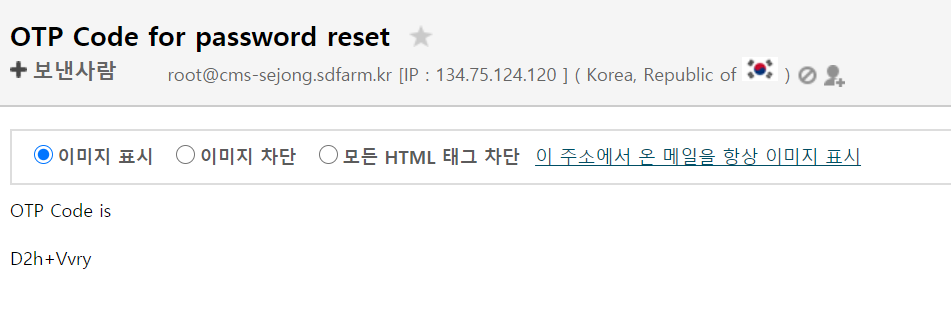

# FAQ

### 1. scram build시 컴파일 에

.png>)

위 에러의 경우는 CMSSW framework 디렉토리에서 CMSSW 환경과 sft.cern.ch에 있는 ROOT 환경이 충돌하여 발생하였습니다. 깨끗한 환경변수 상태에서 cmsenv만 진행 후 작업하면 이상이 없습니다.

### 2. 작업이 끝나지 않아요!

끝날 시간이 되었으나 끝나지 않는 작업의 경우 몇가지를 확인하여야 합니다.

(1) 사용하는 데이터 파일이 외부에 있는 경우,

작업의 CPU 사용률을 확인하면 대략 알 수 있습니다.

```
[geonmo@ui20 manifests]$ condor_jobstatus runiyal
 ID         Owner   RemoteHost                    CPUsUsage            
9100463.0   runiyal slot1@bio-wn3006.sdfarm.kr    0.001307340657177903 
9100471.0   runiyal slot1@bio-wn3017.sdfarm.kr    0.002598957544583386 
9100537.0   runiyal slot1@bio-wn3015.sdfarm.kr    0.002616651650138061 
9100561.0   runiyal slot1@bio-wn3015.sdfarm.kr    0.002691392044219451 
9100664.0   runiyal slot3@bio-wn3016.sdfarm.kr    0.002509965002770551 
9100709.0   runiyal slot1@bio-wn3011.sdfarm.kr    0.004661354284485942 
9101560.0   runiyal slot2@bio-wn3011.sdfarm.kr    0.004759655887460485 
9101561.0   runiyal slot3@condor-wn1012.sdfarm.kr 0.02173146070995057  
9101575.0   runiyal slot2@condor-wn1008.sdfarm.kr 0.002791534221159765 

```

분석 데이터 파일이 KISTI가 아니라 외부의 있는 경우 뿐만 아니라 premixing 등에 사용되는 pileup event가 외부 사이트에 있을 경우에도 속도가 매우 떨어지게 됩니다. 해결방법은 해당 데이터들을 사이트 관리자의 도움을 받아 KISTI로 전송하는 것입니다.

(2)  머신 상태가 불량한 경우,

아래처럼 작업의 CPU 사용률이 0.0이면서 같은 머신에서 여러 작업들이 멈쳐 있는 경우라면 해당 머신에 문제가 생긴 것으로 판단할 수 있습니다.

```
[geonmo@ui20 manifests]$ condor_jobstatus geonmo
9100560.0   geonmo slot1@condor-wn1016.sdfarm.kr 0.0                  
9100560.1   geonmo slot1@condor-wn1016.sdfarm.kr 0.0                  
9100560.2   geonmo slot1@condor-wn1016.sdfarm.kr 0.0                  
```

### 3. 패스워드를 리셋하고 싶어요!

패스워드를 리셋하려면 텔레그램에서 @GSDCAccountBot을 친구 추가해주세요.

* GSDCAccountBot 창에서 "/start" 명령어로 시작합니다.

.png>)

* \[Reset password]를 선택하면 "커뮤니티" 이름을 물어봅니다. 이때, "CMS"를 입력합니다.

![커뮤니티 이름은 \[CMS\] 입니다.](<.gitbook/assets/image (4).png>)

* 아이디와 이메일 주소를 입력합니다.

.png>)

* 이메일로 수신된 OTP 코드를 입력합니다.



.png>)

* 정상적으로 마무리되면 이메일 주소로 리셋된 패스워드가 전송됩니다. 해당 패스워드로 접속을 하면 패스워드를 바로 변경할 수 있습니다.
