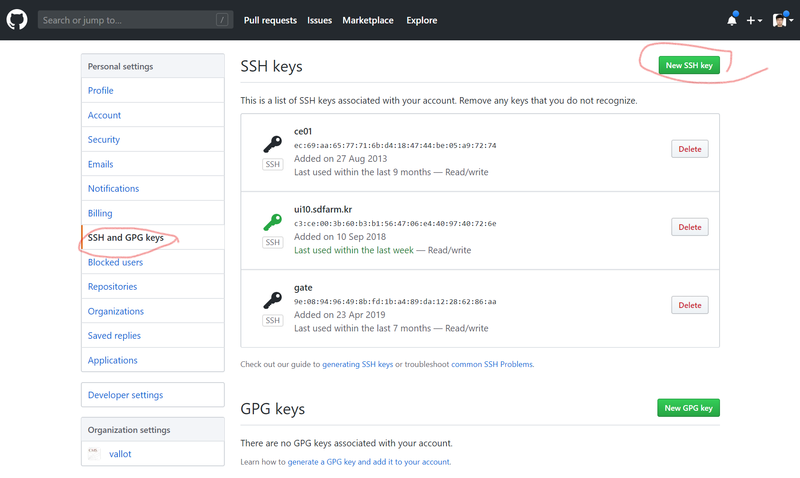

# 초기 환경 설정

## OTP 토큰 등록

### OTP 등록 절차 안내

첫 접속을 하시면 바로 OTP 등록 작업을 진행해주시기 바랍니다. OTP가 등록되지 않은 계정은 그 다음 영업일에 계정이 비활성화될 수 있습니다.

토큰 발급은 아래와 같이 진행합니다.

```bash
## 언어 혹은 인코딩 설정이 C 로 되어 있는 경우에는 정상적으로 OTP QR 코드를 확인할 수 없습니다. 
## 따라서, 이를 해제해야 합니다. 비트워든 같은 프로그램은 QR코드가 아니라 URI로 등록이 가능하므로
## 이를 이용하실 때에는 무시하셔도 됩니다.
export LANG=en_US.UTF-8
export LC_ALL=en_US.UTF-8
## 토큰을 발급합니다.
ipa otptoken-add
```

## 그리드 인증서 설치&#x20;

### 인증서 발급과 VO CMS 가입

인증서는 CERN CA 홈페이지([https://ca.cern.ch/ca/](https://ca.cern.ch/ca/))에서 \[New Grid User certificate] 항목을 이용하여 발급 받을 수 있습니다. 인증서는 발급 받은 직후에는 아무런 권한이 부여되어 있지 않습니다.  발급 후 VO CMS ([https://lcgvoms24.cern.ch:8443/voms/cms/user/home.action](https://lcgvoms24.cern.ch:8443/voms/cms/user/home.action)) 를 방문하여 CMS 자원 활용을 허가 받을 수 있습니다.

사용자는 VO CMS에 승인된 그리드 사용자 인증서를 이용하여 CMS 자원들에 접근할 수 있습니다. 예외적으로 KISTI CMS Tier-3 사용자 분들은 KISTI CMS Tier-3에 저장된 데이터에 접근을 할 때 해당 인증 없이 사용이 가능하도록 설정되어 있습니다. 하지만, 외부에 존재하는 데이터에 접근하기 위해서는 반드시 사용자 인증서가 있어야 합니다. 또한, 사용자가 그리드 작업을 제출하려면  본인의  인증서를 제출하려는 서버에 설치하여야 합니다.

### 인증서 매핑 작업

&#x20;KISTI에서도 인증서를 발급하고 있습니다. ([http://ca.gridcenter.or.kr/](http://ca.gridcenter.or.kr/)) 해당 인증서를 발급 받고 CERN 인증서와 동일하게 사용하시려면 인증서 매핑 작업을 수행하여야 합니다.  인증서를 CERN 컴퓨팅 계정과 동기화해야하기 때문에 일반적인 경우에는 필요가 없습니다. 하지만, CERN 이외의 프로젝트를 같이 수행할 경우 KISTI 인증서가 편리할 수도 있습니다. (타 프로젝트에서 인증서 매핑을 지원하지 않을 경우)

&#x20;CERN 인증서는 CERN 컴퓨팅 계정과 자동으로 매핑되기 때문에 별도의 설정이 필요 없으나 KISTI에서 인증서를 발급 받으시면 반드시 CERN CA 홈페이지에 접속하셔서 매핑 작업을 하셔야 합니다.


CERN CA나 KISTI CA를 통해 발급 받은 인증서를 브라우저의 인증서 관리를 통해 .pfx 파일로 추출할 수 있습니다. 이를 CMS Tier-3 UI 서버로 업로드하실 수 있습니다.

### 인증서 복사

#### 리눅스 혹은 MacOS 사용자

scp 명령어를 통해 파일을 UI 서버로 전송하실 수 있습니다.

```bash
## ssh 명령어와 달리 대문자 P로 포트 번를 지정합니다.
scp -P [Port Number] [Hostname of UI Server]
```

#### 윈도우 사용자&#x20;

윈도우 사용자들은 MobaXterm의 \[Session] - \[SFTP] 를 이용하여 파일을 전송하실 수 있습니다.

![MobaXterm의 \[SFTP\] 세션 화면. 드래그를 통해 파일을 전송할 수 있습니다.](.gitbook/assets/mobaxterm\_SFTP\_01.PNG)

#### 인증서 변환 및 설정&#x20;

복사된 인증서 .pfx  혹은 .p12 파일을 이용하여 그리드 작업 프로그램에서 사용하는 PEM 형식으로 파일을 변환합니다.

```bash
mkdir $HOME/.globus
chmod 755 $HOME/.globus
openssl pkcs12 -in myCert.p12 -clcerts -nokeys -out $HOME/.globus/usercert.pem
openssl pkcs12 -in myCert.p12 -nocerts -out $HOME/.globus/userkey.pem
chmod 644 $HOME/.globus/usercert.pem
chmod 400 $HOME/.globus/userkey.pem
```

## (향후 사용예정) OIDC를 이용한 scitoken 등록

oidc-agent는 사용방법이 기존 SSH 인증서를 등록하는 ssh-agent와 사용방법이 유사합니다. 사용방법을 잊어버렸을 경우를에대비하여   ssh-agent 사용방법과 유사하게 사용을 할 수 있도록 구성을 하시는 것을 추천드립니다.

### 1. oidc-agent 설정 및 oidc-gen으로 신규 scitoken 등록 및 사용

```bash
eval $(oidc-agent)
oidc-gen -w device [token_name]

# Issuer [https://iam-test.indigo-datacloud.eu/]: 
# Issuer 로 https://cms-auth.web.cern.ch/ 입력
https://cms-auth.web.cern.ch/

# Scopes로 max 입력. 향후 scope 정보를 잘 알게되면 조정할 것
max
```

### 2. https://cms-auth.web.cern.ch/device 접속 후 코드 입력

```bash
Registering Client ...
Warning: The registered client does not have all the requested scopes. The following are missing: storage.create:/store/temp/sitetest storage.modify:/store/temp/sitetest
To update the client to have all the requested scope values, please contact the provider.
Generating account configuration ...
accepted

Using a browser on any device, visit:
https://cms-auth.web.cern.ch/device

And enter the code: ?????
Alternatively you can use the following QR code to visit the above listed URL.
```

### 3. scitoken의 비밀번호 입력

```bash
Enter encryption password for account configuration 'geonmo_scitoken': 
Confirm encryption Password: 
Everything setup correctly!
```

### 4. 토큰 사용을 위한 oidc 토큰 등록 및 임시토큰 발행

```bash
oidc-add [Token Name]

export BEARER_TOKEN=$(oidc-token --scope=storage.read:/ --scope=compute.read --time=3600 [Token Name])
```

### 5. 토큰을 이용한 테스트

```bash
## XRootD
XrdSecPROTOCOL="ztn,unix";export XrdSecPROTOCOL

xrdfs cms-xrdr.sdfarm.kr ls /xrd
xrdfs cms-t2-se01.sdfarm.kr:1095 ls /

## WebDAVs
davix-ls  --capath /etc/grid-security/certificates -H "Authorization: Bearer ${BEARER_TOKEN}" davs://cms-t2-se01.sdfarm.kr:2880//store/user/geonmo

```

## CMSSW 환경 설정&#x20;

CMS 연구 프레임워크인 CMSSW는 CERN에서 제공하는 CVMFS(CERN Virtual Machine File System)에 의해 제공됩니다. 따라서, 아래 명령어를 실행하여 CMSSW 사용 환경을 구축할 수 있습니다.

```bash
## bash 사용자
source /cvmfs/cms.cern.ch/cmsset_default.sh
## tcsh 사용자
source /cvmfs/cms.cern.ch/cmsset_default.csh
```

환경변수들이 올바르게 적용되면 scram, cmsenv 등 CMSSW 명령어들을 사용하실 수 있습니다. 아래와 같은 방법으로 CMSSW 버전을 확인할 수 있습니다.

```bash
## On ui10, 
export SCRAM_ARCH=slc6_amd64_gcc700
scram list CMSSW 
## On ui20, 
export SCRAM_ARCH=slc7_amd64_gcc700
scram list CMSSW 
```


CMSSW 소프트웨어의 버전은 연구별로 상이하므로 개별적으로 확인 바랍니다. SCRAM\_ARCH 변수를 통해 설치 가능한 CMSSW의 버전이 변동되므로 참고 바랍니다. 자세한 버전 설명은 CMSSW GitHub 홈페이지([http://cms-sw.github.io/showIB.html](http://cms-sw.github.io/showIB.html))를 참고하시거나 Release Map([https://cmssdt.cern.ch/SDT/releases.map](https://cmssdt.cern.ch/SDT/releases.map))을 참고하시기 바랍니다. (참고 : type=Production;state=Announced;prodarch=1)


## CMSSW 작업 디렉토리 생성

CMSSW 버전을 확인한 후에 다음 명령어로 CMSSW 작업 디렉토리를 생성할 수 있습니다.

```bash
## SCRAM_ARCH를 별도로 지정하는 경우,
export SCRAM_ARCH=slcX_amd64_gccXXX
## 작업 디렉토리 생성
cmsrel CMSSW_10_4_0
### 디렉토리 이름을 지정할 경우,
scram p -n workspace CMSSW CMSSW_10_4_0
```

작업 디렉토리가 생성되면 해당 디렉토리를 이용하여 환경변수를 설정할 수 있습니다. 이를 실행하여야 CRAB이 사용가능합니다.

```bash
cd CMSSW_10_4_0
cd src
cmsenv
```

## CRAB 환경 설정&#x20;

CRAB은 CMS 연구자들이 사용하는 그리드 작업 제출 프로그램입니다.&#x20;

CRAB을 사용하려면 CRAB과 관련한 환경변수들을 적용하여야 합니다. CVMFS를 통해 해당 환경변수들을 설정하실 수 있습니다.

```bash
### 올바른 CMSSW 작업 디렉토리에서 cmsenv를 수행한 후에,
### For bash users,
source /cvmfs/cms.cern.ch/crab3/crab.sh
```

그리드 작업을 제출하기 앞서 반드시 본인이 T2\_KR\_KISTI와 T3\_KR\_KISTI에 쓰기 권한이 있는지를 확인하셔야 합니다.

&#x20;다음 명령어로 이를 확인하실 수 있습니다.

```bash
## To T2_KR_KISTI
crab checkwrite --site=T2_KR_KISTI

## To T3_KR_KISTI
crab checkwrite --site=T3_KR_KISTI
```

> Checkwrite Result:\
> Success: Able to write in /store/user/geonmo on site T2\_KR\_KISTI

만약, 쓰기가 불가능하시면  [cmst3-support@kisti.re.kr](mailto:cmst3-support@kisti.re.kr) 로 이메일을 보내주시기 바랍니다.

## Rucio 환경 설정

Rucio는 ATLAS실험에서 데이터셋 관리를 위해 작성된 데이터 관리 프로그램입니다. Rucio를 사용하려면 아래 설정이 필요합니다.

```bash
## No cmsenv environment
source /cvmfs/cms.cern.ch/cmsset_default.sh
source /cvmfs/cms.cern.ch/rucio/setup.sh
export RUCIO_USER=$(whoami)

## or T3_KR_KISTI에서는 위 명령어를 다음 예약어를 설정하여 사용 중입니다.
### rucioenv는 cmsenv 설정 후에는 작동하지 않습니다. 
### 별개의 세션(신규 접속)에서 실행하는 것을 추천드립니다.
rucioenv
```

## /xrootd\_users 디렉토리 생성

KISTI CMS Tier-3에서 제공해드리는 장기 보관용 저장소인 /xrootd 공간은 OS에서의 직접 접속을 금지하고 대신 xrdfs, gfal-copy 등의 전송 프로그램을 쓰도록 안내드리고 있습니다. 하지만, 사용자의 편의성을 증대하기 위해 신청자를 대상으로 /xrootd\_users 디렉토리에 본인의 저장소 공간을 UI 서버들에 마운트를 해드리고 있습니다. (WN에는 마운트해드리지 않습니다.)

신청을 하실 때에는 CERN 계정과 KISTI 계정 정보를 알려주셔야 합니다. CERN 컴퓨팅 계정을 잘 모르실 경우 아래의 CRAB 명령어를 통해 확인하실 수 있습니다.

```bash
crab checkusername
```

> Retrieving DN from proxy... \
> DN is: /C=KR/O=KISTI/O=KISTI/CN=58079576 Geonmo Ryu Retrieving username for this DN... \
> username is geonmo

위 명령어로 확인한 CERN 계정과 KISTI 계정을 관리자에게 보내주시면 /xrootd\_users/\<userid> 디렉토리 밑에 사용자 저장소를 마운트해드립니다.


디렉토리가 생성된 이후에는 일반 디렉토리를 사용하시듯이 cp, rm 명령어로 파일을 관리하시면 됩니다. 단, mv 명령어는 자제해주시기 바랍니다.


해당 디렉토리는 사용자가 접근하면 자동으로 마운트되도록 autofs로 설정되어 있습니다. 하지만, 마운트가 안된 상태에서 여러 차례 접근을 시도하면 마운트 충돌로 인해 아래의 메시지가 표시되면서 사용이 불가능해집니다. 아래의 메시지가 나타나면 즉시 관리자에게 연락을 주시기 바랍니다.

> 전송 종료지점이 연결되어 있지 않습니다 / Transport endpoint is not connected

## GitHub 사용을 위한 공개키 등

CMS 연구에 사용되는 많은 코드들은 현재 GitHub에 등록되어 있습니다. 해당 코드를 UI 서버로 다운로드 받으실 때에는 저장소에서 제공되는 HTTPS 명령어를 사용하시면 편리하게 이용하실 수 있습니다. 하지만, 해당 저장소의 코드를 수정한 후 다시 업로드를 원하신다면 GitHub에 공개키를 등록하시기를 권장드립니다.

SSH 공개키를 만들기 위해서는 다음과 같은 작업이 필요합니다.

```bash
[geonmo@ui10 .ssh]$ ssh-keygen -t rsa
Generating public/private rsa key pair.
Enter file in which to save the key (/share/geonmo/.ssh/id_rsa): 
Enter passphrase (empty for no passphrase): 
Enter same passphrase again: 
Your identification has been saved in /share/geonmo/.ssh/id_rsa.
Your public key has been saved in /share/geonmo/.ssh/id_rsa.pub.
The key fingerprint is:
1c:17:f5:77:f0:77:06:f6:8e:3e:32:49:24:2c:e9:cf geonmo@ui10.sdfarm.kr
The key's randomart image is:
+--[ RSA 2048]----+
|          ... +  |
|         o . o = |
|        + + . . O|
|       o + o   =+|
|        S   . . .|
|         o . o   |
|          E + o  |
|             o . |
|                 |
+-----------------+

```


암호를 입력하지 않은 공개 및 비밀키를 만드시려면 Enter passphrase 항목에서 내용 없이 엔터를 입력하시면 됩니다. 해당 ssh 키 중 비밀키(id\_rsa)는 절대 유출이 되면 안됩니다. 암호 없이 만들어지기 때문에 외부 유출이 되면 해킹의 위험이 크므로 관리를 철저히 해주시기 바랍니다. (패스워드 유무와 상관없이 비밀키는 유출되면 안됩니다.)



만약 암호를 설정하셨다면 ssh-agent를 이용하여 한번만 암호를 입력하시고 해당 세션 정보로 다른 서버로 접속하는 등의 기능을 사용하실 수 있습니다. 해당 내용은 여기서 다루지 않습니다.


생성된 공개키를 GitHub에 등록하시려면 해당 공개키의 정보를 확인하셔야 합니다. 간단하게 cat 명령어를 이용하여 내용을 확인하실 수 있습니다.

```bash
[geonmo@ui10 .ssh]$ cat id_rsa.pub
ssh-rsa AAAAB3NzaC1yc2EAAAABIwAAAQEAx3hsrp0tvlSt/Icp2hGQxeRmlIejJTugj/v4DnoztKRQIIiRgWKHDpxKji1eR7A9YusN51G6bZL5RZzJSfgbWiVBfmAKNfiQjHMte80vQlWdtTVXXff05k+aslqUWUTnuquhRnbS0hngamFrISW5/cQMDWUXEi0E4+UKcweG4pWsAYOaFgshj9dQ63JtOMOmbamhXNMxwhtFViQMSHVrEikHXsVIQx6bt64CYjQoGkkyXyqb5AdOtUtwDgRp/GIJSTia78NugdlGY/SdGmYlFR00LpNOqVoJ1tDRS6TniCmx26gTiUUYVDZ84WyNtvwFDaSphdBDDn3rXlgEuf9iBQ== geonmo@ui10.sdfarm.kr
```

GitHub에 계정 가입 후 로그인을 한 후 \[프로필 사진] - \[계정 설정]을 클릭합니다.

![\[계정 설정\] 항목 위치 ](.gitbook/assets/github.png)

\[Settings] - \[SSH and GPG keys] - \[New SSH Key] 항목을 선택한 후 위에서 확인한 키 정보를 입력해줍니다.



등록이 완료되면 해당 저장소의 권한 설정에 따라 내용 수정 (commit)후 업로드(git push)가 가능해집니다. 물론, 저장소에 대한 권한이 없다면 불가능하오니 참고 바랍니다.

## 참고문헌

1. CERN CA 홈페이지([https://ca.cern.ch/ca/Help/?kbid=024010](https://ca.cern.ch/ca/Help/?kbid=024010))
2. VO CMS 가입 홈페이지([https://lcgvoms24.cern.ch:8443/voms/cms/user/home.action](https://lcgvoms24.cern.ch:8443/voms/cms/user/home.action))
3. CMS 인증서 발급 안내 TWiki page ([https://twiki.cern.ch/twiki/bin/view/CMSPublic/SWGuideLcgAccess](https://twiki.cern.ch/twiki/bin/view/CMSPublic/SWGuideLcgAccess))
4. CMS 워크북 TWiki Page\
   ([https://twiki.cern.ch/twiki/bin/view/CMSPublic/WorkBook](https://twiki.cern.ch/twiki/bin/view/CMSPublic/WorkBook))


