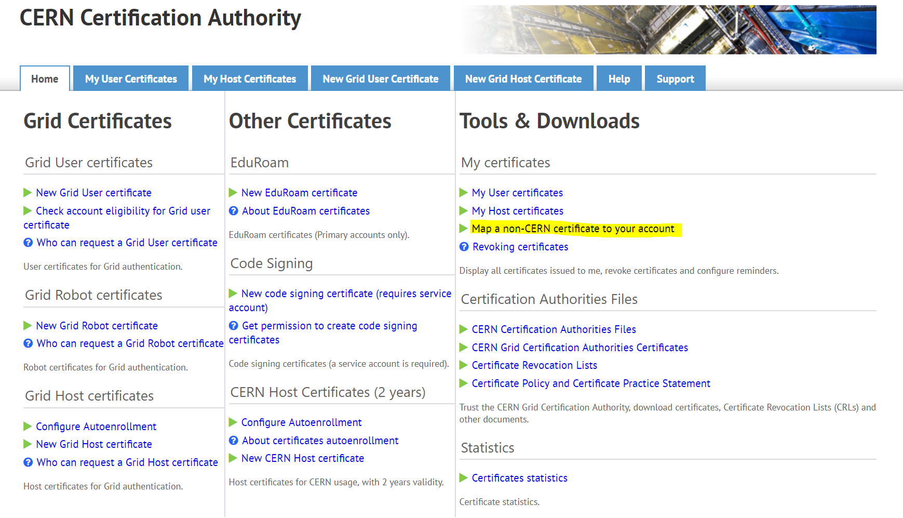

# Initial configuration guide for first-time users

## Install your grid CA

### Issuing a certificate and signing up for VOCMS.

Certificates can be issued on the CERNCA website (https://ca.cern.ch/ca/) using the \[New Grid User Certificate] item. Certificates are not authorized immediately after issuance. After issuance, you can visit VO CMS (https://lcgvoms24.cern.ch:8443/voms/cms/user/home.action) to get permission to use CMS resources.

Users can access CMS resources using a grid user certificate approved for VO CMS. Exceptionally, KISTI CMS Tier-3 users are enabled to access data stored in KISTI CMS Tier-3 without corresponding authentication. However, you must have a user certificate to access data from outside. In addition, in order for the user to submit grid jobs, it must be installed on the server where he or she wants to submit his or her certificate.

Certificate mapping

&#x20;KISTI is also issuing certificates. (http://ca.gridcenter.or.kr/) In order to obtain the corresponding certificate and use it the same as the CERN certificate, you must perform a certificate mapping operation. In general cases, it is unnecessary because the certificate must be synchronized with the CERN computing account. However, KISTI certificates may be convenient if you work on projects other than CERN. (If other projects do not support certificate mapping)

CERN certificates are automatically mapped to CERN computing accounts, so you don't need to set them up separately, but if you get a certificate issued by KISTI, you must access the CERNCA website to do the mapping.



Certificates issued through CERN CA or KISTICA can be extracted into .pfx files through certificate management in the browser. You can upload this to the CMS Tier-3 UI server.

## Certificate installation

#### For Linux or MacOS Users

Using scp command, the cert file can be copied to UI servers.

```bash
## unliks as ssh command, 
## to use the capital P option to select a port number
scp -P [Port Number] [Hostname of UI Server]
```

#### For Windows Users

To copy file, use MobaXterm's \[Session] - \[SFTP] option.

![MobaXterm의 \[SFTP\] 세션 화면. 드래그를 통해 파일을 전송할 수 있습니다.](.gitbook/assets/mobaxterm_SFTP_01.PNG)

#### Converting cert and configuration

Below commands to convert from .pfxor .p12 to PEM format which is used for GRID application.

```bash
mkdir $HOME/.globus
chmod 755 $HOME/.globus
openssl pkcs12 -in myCert.p12 -clcerts -nokeys -out $HOME/.globus/usercert.pem
openssl pkcs12 -in myCert.p12 -nocerts -out $HOME/.globus/userkey.pem
chmod 644 $HOME/.globus/usercert.pem
chmod 400 $HOME/.globus/userkey.pem
```

## Setting CMSSW

CMSSW, CMS analysis framework, is distributed using CVMFS (CERN Virtual Machine File System) which is provided by CERN

You can CMSSW environment to follow the below commands.

```bash
## bash users
source /cvmfs/cms.cern.ch/cmsset_default.sh
## tcsh users
source /cvmfs/cms.cern.ch/cmsset_default.csh
```

After environment setting, you can use CMSSW command like scram, cmsenv . In addition, you can find available CMSSW version as below.

```bash
## On ui10, 
export SCRAM_ARCH=slc6_amd64_gcc700
scram list CMSSW 
## On ui20, 
export SCRAM_ARCH=slc7_amd64_gcc700
scram list CMSSW 
```


For analysis topic, CMSSW version may be different. In addition, Please note that the version of CMSSW that can be installed through the SCRAM\_ARCH variable changes. For detail, please visit CMSSW GitHub homepage([http://cms-sw.github.io/showIB.html](http://cms-sw.github.io/showIB.html)) or  Release Map([https://cmssdt.cern.ch/SDT/releases.map](https://cmssdt.cern.ch/SDT/releases.map))

(production version : type=Production;state=Announced;prodarch=1)


## Create CMSSW directory

After checking CMSSW version, you can create a CMSSW work directory as belows.

```bash
## If you need to set SCRAM_ARCH,
export SCRAM_ARCH=slcX_amd64_gccXXX
## Create CMSSW base directory,
cmsrel CMSSW_10_4_0
### If you want to rename directory
scram p -n workspace CMSSW CMSSW_10_4_0
```

Then, you should set up the environment according to CMSSW directory. It is necessary to use CRAB(GRID Job Tool).&#x20;

```bash
cd CMSSW_10_4_0
cd src
cmsenv
```

## Set up CRAB environment

CRAB is a GRID Job manager for CMS researchers.

You can set up the crab environment to use the CRAB command. You can use a crab environment source in CVMFS.

```bash
### 올바른 CMSSW 작업 디렉토리에서 cmsenv를 수행한 후에,
### For bash users,
source /cvmfs/cms.cern.ch/crab3/crab.sh
```

Before a GRID job submits, Please check your writing permission for T2\_KR\_KISTI and T3\_KR\_KISTI.

Please, follow the below commands to check the permission.

```bash
## To T2_KR_KISTI
crab checkwrite --site=T2_KR_KISTI

## To T3_KR_KISTI
crab checkwrite --site=T3_KR_KISTI
```

> Checkwrite Result:\
> Success: Able to write in /store/user/geonmo on site T2\_KR\_KISTI

If you fail this command, please contact us. ([cmst3-support@kisti.re.kr](mailto:cmst3-support@kisti.re.kr))

## Set up Rucio&#x20;

Rucio is a dataset manager which was developed by ATLAS team. Recently CMS computing team choose Rucio as the next dataset manager instead of PhEDEx. For Rucio, you can set up the rucio environment as below.

```bash
## Do not cmsenv for rucio
source /cvmfs/cms.cern.ch/cmsset_default.sh
source /cvmfs/cms.cern.ch/rucio/setup.sh
export RUCIO_USER=$(whoami)

## or On T3_KR_KISTI,
rucioenv
### rucioenv is not working after cmsenv command.
```

## Create /xrootd\_users directory&#x20;

The /xrootd space, long-term storage provided by KISTI CMS Tier-3, prohibits POSIX access from the OS. We recommend using 3rd party programs such as xrdfs and gfal-copy instead. However, to increase user convenience, we are mounting your storage space to UI servers in the /xrootd\_users directory for _applicants. (We don't mount it on WN.)_ When you want to your /xrootd\_user directory, you must let us know the CERN account and KISTI account information. If you are not familiar with the CERN computing account, you can check it through the CRAB command below.

```bash
crab checkusername
```

> Retrieving DN from proxy... \
> DN is: /C=KR/O=KISTI/O=KISTI/CN=58079576 Geonmo Ryu Retrieving username for this DN... \
> username is geonmo

We will create your xrootd user directory if you request with CERN account ID.


You can use the xrootd\_users directory as a POSIX mount. However, you should not use the mv command due to the limitation of our storage system.


The directory is set to autofs so that it can be automatically mounted upon user access. However, if you try to access it several times before mounting, the message below will be displayed due to mount collision and you will not be able to use it. If you see the message below, please contact us([cmst3-support@kisti.re.kr](mailto:cms-t3-support@kisti.re.kr)) immediately.

> 전송 종료지점이 연결되어 있지 않습니다 / Transport endpoint is not connected

## Create SSH key pair for GitHub

Various analysis codes were uploaded on Github. If you just download that codes, you can use GitHub Token. However, we recommend registering your ssh public key.&#x20;

To create SSH key pair, follow as below.

```bash
[geonmo@ui10 .ssh]$ ssh-keygen -t rsa
Generating public/private rsa key pair.
Enter file in which to save the key (/share/geonmo/.ssh/id_rsa): 
Enter passphrase (empty for no passphrase): 
Enter same passphrase again: 
Your identification has been saved in /share/geonmo/.ssh/id_rsa.
Your public key has been saved in /share/geonmo/.ssh/id_rsa.pub.
The key fingerprint is:
1c:17:f5:77:f0:77:06:f6:8e:3e:32:49:24:2c:e9:cf geonmo@ui10.sdfarm.kr
The key's randomart image is:
+--[ RSA 2048]----+
|          ... +  |
|         o . o = |
|        + + . . O|
|       o + o   =+|
|        S   . . .|
|         o . o   |
|          E + o  |
|             o . |
|                 |
+-----------------+

```


암호를 입력하지 않은 공개 및 비밀키를 만드시려면 Enter passphrase 항목에서 내용 없이 엔터를 입력하시면 됩니다. 해당 ssh 키 중 비밀키(id\_rsa)는 절대 유출이 되면 안됩니다. 암호 없이 만들어지기 때문에 외부 유출이 되면 해킹의 위험이 크므로 관리를 철저히 해주시기 바랍니다. (패스워드 유무와 상관없이 비밀키는 유출되면 안됩니다.)



만약 암호를 설정하셨다면 ssh-agent를 이용하여 한번만 암호를 입력하시고 해당 세션 정보로 다른 서버로 접속하는 등의 기능을 사용하실 수 있습니다. 해당 내용은 여기서 다루지 않습니다.


생성된 공개키를 GitHub에 등록하시려면 해당 공개키의 정보를 확인하셔야 합니다. 간단하게 cat 명령어를 이용하여 내용을 확인하실 수 있습니다.

```bash
[geonmo@ui10 .ssh]$ cat id_rsa.pub
ssh-rsa AAAAB3NzaC1yc2EAAAABIwAAAQEAx3hsrp0tvlSt/Icp2hGQxeRmlIejJTugj/v4DnoztKRQIIiRgWKHDpxKji1eR7A9YusN51G6bZL5RZzJSfgbWiVBfmAKNfiQjHMte80vQlWdtTVXXff05k+aslqUWUTnuquhRnbS0hngamFrISW5/cQMDWUXEi0E4+UKcweG4pWsAYOaFgshj9dQ63JtOMOmbamhXNMxwhtFViQMSHVrEikHXsVIQx6bt64CYjQoGkkyXyqb5AdOtUtwDgRp/GIJSTia78NugdlGY/SdGmYlFR00LpNOqVoJ1tDRS6TniCmx26gTiUUYVDZ84WyNtvwFDaSphdBDDn3rXlgEuf9iBQ== geonmo@ui10.sdfarm.kr
```

GitHub에 계정 가입 후 로그인을 한 후 \[프로필 사진] - \[계정 설정]을 클릭합니다.

![\[계정 설정\] 항목 위치 ](.gitbook/assets/github.png)

\[Settings] - \[SSH and GPG keys] - \[New SSH Key] 항목을 선택한 후 위에서 확인한 키 정보를 입력해줍니다.


등록이 완료되면 해당 저장소의 권한 설정에 따라 내용 수정 (commit)후 업로드(git push)가 가능해집니다. 물론, 저장소에 대한 권한이 없다면 불가능하오니 참고 바랍니다.

## References

1. CERN CA ([https://ca.cern.ch/ca/Help/?kbid=024010](https://ca.cern.ch/ca/Help/?kbid=024010))
2. VO CMS ([https://lcgvoms24.cern.ch:8443/voms/cms/user/home.action](https://lcgvoms24.cern.ch:8443/voms/cms/user/home.action))
3. CMS TWiki page for lcg access ([https://twiki.cern.ch/twiki/bin/view/CMSPublic/SWGuideLcgAccess](https://twiki.cern.ch/twiki/bin/view/CMSPublic/SWGuideLcgAccess))
4. CMS Workbook TWiki Page\
   ([https://twiki.cern.ch/twiki/bin/view/CMSPublic/WorkBook](https://twiki.cern.ch/twiki/bin/view/CMSPublic/WorkBook))


